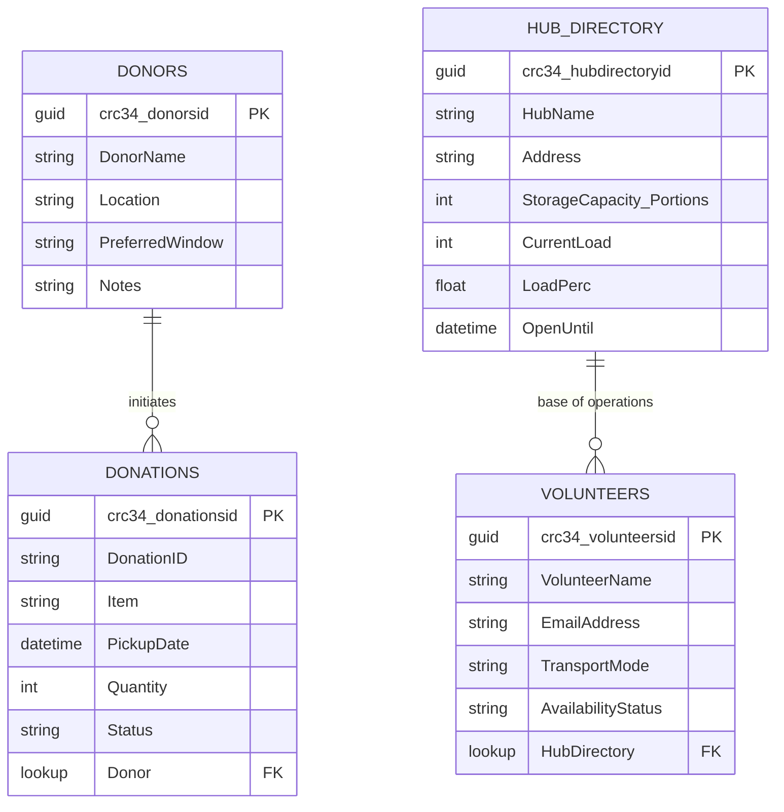

# Database Schema

Reference for the Dataverse tables used by FoodLink agents in this workshop.

For setup instructions, see [setup-guide.md](setup-guide.md). For how these tables are used by agents, see [01-Copilot-Studio/lab-guide.md](../01-Copilot-Studio/lab-guide.md).

---

## 📋 Core Tables

**🤝 Donors**

- Purpose: Partner profile and intake defaults.
- Key fields: DonorId, DonorName, Location, PreferredWindow, Notes.

| DonorName | Location | PreferredWindow | Notes |
|---|---|---|---|
| Green Valley Farm | Camden, London | 07:00–09:00 | Organic produce only |

**📦 Donations**

- Purpose: Every donation event captured by Donor Assistant.
- Key fields: DonationId, Donor (lookup), Item, Quantity, PickupDate, Status.

| DonationID | Item | Quantity | PickupDate | Status | Donor |
|---|---|---|---|---|---|
| DON-001 | Apples (kg) | 50 | 2026-04-01 | Pending | Green Valley Farm |

**🏠 Hub Directory**

- Purpose: Capacity and load balancing decisions for dispatch.
- Key fields: HubId, HubName, Address, StorageCapacityPortions, CurrentLoad, OpenUntil.
- Calculated field: LoadPerc = CurrentLoad / StorageCapacityPortions.

| HubName | Address | StorageCapacity_Portions | CurrentLoad | LoadPerc | OpenUntil |
|---|---|---|---|---|---|
| Southwark Hub | 12 Borough Rd, SE1 | 500 | 320 | 0.64 | 2026-04-01 18:00 |

**🙋 Volunteers**

- Purpose: Dispatcher candidate pool.
- Key fields: VolunteerId, VolunteerName, EmailAddress, TransportMode, AvailabilityStatus, HomeHub (lookup).

| VolunteerName | EmailAddress | TransportMode | AvailabilityStatus | HomeHub |
|---|---|---|---|---|
| Priya Singh | priya@example.com | Bicycle | Available | Southwark Hub |

---

## 🔗 Entity-Relationship Diagram

---

For production-ready architecture:

- **Dataverse** for Power Platform-native integration, security, and governance.
- **Azure SQL Database** for transactional relational workloads at scale.
- **Microsoft Fabric OneLake + Warehouse/Lakehouse** for analytics and reporting.

For rapid prototyping, it is also possible to use **Excel connector-based tools**, but Dataverse is preferred for reliability in orchestrated flows.

---

**← Back:** [Setup Guide](setup-guide.md) | **Next step →** [01-Copilot-Studio](../01-Copilot-Studio/lab-guide.md) | **↑ Home:** [README.md](../README.md)
