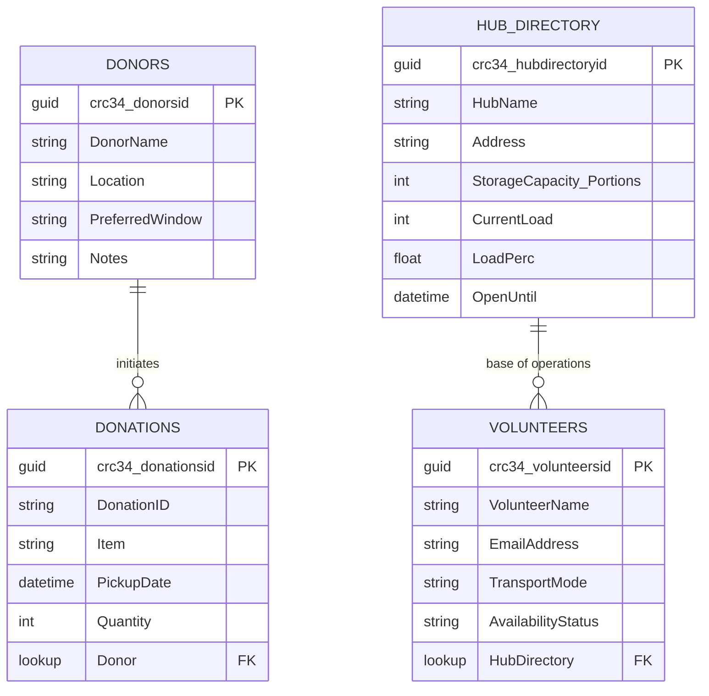

### 1. Data Infrastructure

For the *AI for Good Hackathon* workshop, use Dataverse as the operational data layer so Copilot Studio tools can run reliable lookups, updates, and approval tracking.

#### Core Tables

**Donors**

- Purpose: Partner profile and intake defaults.
- Key fields: DonorId, DonorName, Location, PreferredWindow, Notes.

**Donations**

- Purpose: Every donation event captured by Donor Assistant.
- Key fields: DonationId, Donor (lookup), Item, Quantity, PickupDate, Status.

**Hub Directory**

- Purpose: Capacity and load balancing decisions for dispatch.
- Key fields: HubId, HubName, Address, StorageCapacityPortions, CurrentLoad, OpenUntil.
- Calculated field: LoadPerc = CurrentLoad / StorageCapacityPortions.

**Volunteers**

- Purpose: Dispatcher candidate pool.
- Key fields: VolunteerId, VolunteerName, EmailAddress, TransportMode, AvailabilityStatus, HomeHub (lookup).

#### Entity-Relationship diagram

For production-ready architecture:

- **Dataverse** for Power Platform-native integration, security, and governance.
- **Azure SQL Database** for transactional relational workloads at scale.
- **Microsoft Fabric OneLake + Warehouse/Lakehouse** for analytics and reporting.

For rapid prototyping, it is also possible to use Excel connector-based tools, but Dataverse is preferred for reliability in orchestrated flows.