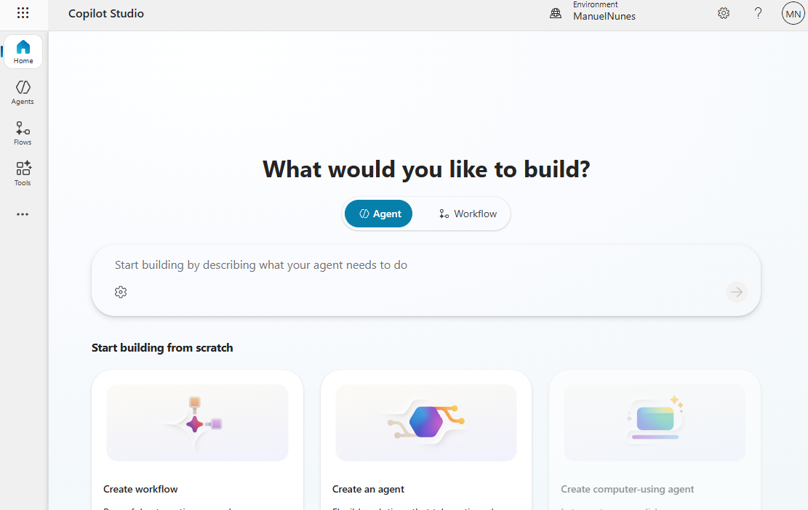
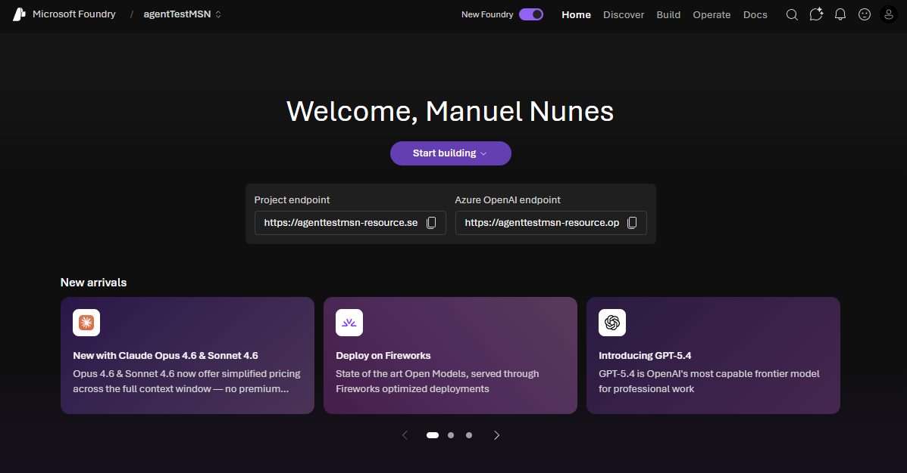

## 00 - Setup Guide

Get everyone ready fast so the hackathon can focus on building impact, not troubleshooting access.

### Participant Account Requirement (Read First) 🔐

Each participant must receive a **work or school account** in the sandbox tenant before the workshop.

- Personal email accounts are not supported for Copilot Studio trial sign-up in this workshop flow.
- The same sandbox identity should be used for both Copilot Studio and Azure sign-in where possible.

### Provisioning Checklist ✅

- Sandbox user accounts for all participants in the workshop tenant.
- Each participant can sign in with their assigned **work or school account**.
- Each participant has access to a Microsoft 365 tenant where **Copilot Studio** is enabled.
- Each participant has access to an Azure subscription for **Azure AI Foundry** activities.

### Step-by-Step: Copilot Studio Free Trial 🤖

1. Go to https://copilotstudio.microsoft.com/.
2. Enter your assigned sandbox **work or school account** email and select **Next**.
3. Complete the prompted verification and profile steps.
4. After sign-up completes, open **Copilot Studio** and confirm the trial is active.

Important notes ⚠️:

- The trial allows creating agents and testing in the test chat panel.
- Publishing is not available on the basic trial flow.
- If prompted that sign-up cannot be completed, your tenant may have self-service sign-up disabled. Contact the tenant admin to enable it.

### Step-by-Step: Azure $200 Free Account (30 Days) ☁️

Reference: https://azure.microsoft.com/en-us/pricing/purchase-options/azure-account

1. Go to https://azure.microsoft.com/en-us/pricing/purchase-options/azure-account and choose **Try Azure for free**.
2. Sign in with your assigned sandbox **work or school account**.
3. Complete identity verification steps (phone and payment method may be requested by Azure for validation).
4. Confirm your free account is provisioned with **$200 credit for 30 days**.
5. Sign in to the Azure portal and verify you can access subscription details.
6. Open Azure AI Foundry ( https://ai.azure.com/ ) and confirm you can create or join a project.

Important notes ⚠️:

- Azure Free is available to new Azure customers.
- Spending protection is available during the free account period.
- If your organization policy blocks sign-up, ask the tenant/subscription admin to pre-provision access.

### Azure Requirements 🧩

- Active Azure subscription.
- Permission to create or use an Azure AI Foundry project.
- Access to model playground features and model catalog browsing.

### Suggested Licensing Baseline 📋

- Copilot Studio license (trial or paid) for each builder.
- Azure subscription with sufficient quota for model testing (**East US 2** and **Sweden Central** are the go-to options for best availability).
- Optional: Power Platform admin access for environment troubleshooting.

