## 01 - Microsoft Copilot Studio Lab Guide

This is the main build segment for the FoodLink demo. Keep momentum high and optimize for a complete, working Copilot Studio orchestration.

### Project Overview: FoodLink AI Ecosystem (Copilot Studio Scope)

In this lab, you'll implement the **agentic orchestration and logistics layer** of FoodLink.

- In Microsoft Copilot Studio scope here: 
  - **FoodLink Agentic AI (Orchestrator)**: Parent agent whose only task is to coordinate the child agents.
  - **Donor Assistant**: Handles food donation requests.
  - **Volunteer Dispatcher**: Matches food donation to available volunteer for pick-up.
  - **Meal Organizer**: Takes raw food items and creates balanced meal plans ready for distribution.
- **Vision Guard (Azure AI Foundry)**, which is implemented in [02-Azure-AI-Foundry/lab-guide.md](../02-Azure-AI-Foundry/lab-guide.md).

### Lab Goals

- Learn how to set up multiple agents in **Microsoft Copilot Studio**, assign each a clear responsibility, and orchestrate them as one end-to-end process.
- Learn how to design robust **Instructions** for sequential stepping and predictable handoffs between parent and child agents.
- Learn how to use **Tools** for deterministic operations (lookups, matching, routing, approvals).
- Learn how to use **Knowledge** with built-in RAG so agents can answer with grounded, context-aware responses.
- Learn how to implement **human-in-the-loop** approval paths for high-impact logistics decisions.
- Learn how to test and validate complex multi-agent flows quickly, including success and fallback paths.

### 1. Data Infrastructure

For the *AI for Good Hackathon* workshop, use Dataverse as the operational data layer so Copilot Studio tools can run reliable lookups, updates, and approval tracking.

#### Core Tables

**Donors**

- Purpose: Partner profile and intake defaults.
- Key fields: DonorId, DonorName, Location, PreferredWindow, Notes.

**Donations**

- Purpose: Every donation event captured by Donor Assistant.
- Key fields: DonationId, Donor (lookup), Item, Quantity, PickupDate, Status.

**Hubs**

- Purpose: Capacity and load balancing decisions for dispatch.
- Key fields: HubId, HubName, Address, StorageCapacityPortions, CurrentLoad, OpenUntil.
- Calculated field: LoadPerc = CurrentLoad / StorageCapacityPortions.

**Volunteers**

- Purpose: Dispatcher candidate pool.
- Key fields: VolunteerId, VolunteerName, EmailAddress, TransportMode, AvailabilityStatus, HomeHub (lookup).

#### Entity-Relationship diagram

```mermaid
erDiagram
    DONORS ||--o{ DONATIONS : "initiates"
    HUB_DIRECTORY ||--o{ VOLUNTEERS : "base of operations"
    
    DONORS {
        guid crc34_donorsid PK
        string DonorName
        string Location
        string PreferredWindow
        string Notes
    }

    DONATIONS {
        guid crc34_donationsid PK
        string DonationID
        string Item
        datetime PickupDate
        int Quantity
        lookup Donor FK
    }

    HUB_DIRECTORY {
        guid crc34_hubdirectoryid PK
        string HubName
        string Address
        int StorageCapacity_Portions
        int CurrentLoad
        float LoadPerc
        datetime OpenUntil
    }

    VOLUNTEERS {
        guid crc34_volunteersid PK
        string VolunteerName
        string EmailAddress
        string TransportMode
        string AvailabilityStatus
        lookup HubDirectory FK
    }
```

For production-ready architecture:

- **Dataverse** for Power Platform-native integration, security, and governance.
- **Azure SQL Database** for transactional relational workloads at scale.
- **Microsoft Fabric OneLake + Warehouse/Lakehouse** for analytics and reporting.

For rapid prototyping, it is also possible to use Excel connector-based tools, but Dataverse is preferred for reliability in orchestrated flows.

### 2. Agent Architecture (Copilot Studio)

#### Orchestrator Agent (Parent)

The central coordinator that triages partner requests, routes to subflows, and ensures food rescue continuity.

#### Agent 1: Donor Assistant (MCS)

- Status: **Functional (Complete)**
- Role: entry point for collection intake.
- Logic:
1. Identify donor by name lookup.
2. Retrieve historical impact stats.
3. Log current surplus item and quantity.
4. Trigger Hub/Dispatcher path for logistics.

[Insert Screenshot of Donor Assistant topic flow]

#### Agent 2: Volunteer Dispatcher (MCS)

- Status: **Functional (Optimization Phase)**
- Role: tactical logistics lead.
- Optimization logic:
1. Query `HubDirectory` and select the hub with the lowest load ratio.
2. Query `VolunteerRegistry` for volunteers marked **Available** at that hub.
3. Select volunteer by `TransportMode` suitability for the requested load.
4. Trigger **Human-in-the-loop approval** via Teams or Outlook using volunteer email.

[Insert Screenshot of Volunteer Dispatcher branching logic]

#### Agent 3: Beneficiary Matcher (MCS)

- Status: **De-scoped for this 2-hour workshop**.
- Note: Keep as a future extension once core logistics flow is stable.

### 3. Build Steps in Copilot Studio

### Step 1: Create the Parent FoodLink Agent

1. Open **Copilot Studio** and select **Create**.
2. Name the agent `FoodLink Orchestrator`.
3. Add a short mission statement focused on food rescue lifecycle automation.
4. Add topic entry points for donor intake and volunteer dispatch.

[Insert Screenshot of FoodLink Orchestrator initial setup]

### Step 2: Implement Donor Assistant Topic

1. Create a topic named **Donor Intake**.
2. Add prompts to capture donor name, item type, and quantity.
3. Add data lookup against `DonationHistory`.
4. Log the current donation and pass handoff variables to dispatcher flow.

[Insert Screenshot of Donor Intake variables and data lookup]

### Step 3: Implement Volunteer Dispatcher Topic

1. Create a topic named **Dispatch Volunteer**.
2. Add lookup logic for lowest `LoadPerc` hub from `HubDirectory`.
3. Filter `VolunteerRegistry` by **Available** and hub match.
4. Add selection logic for transport suitability.

[Insert Screenshot of Hub/Volunteer selection logic]

### Step 4: Add Human Approval via Power Automate

1. Create a cloud flow for approval delivery.
2. Pass selected volunteer email and pickup details to the flow.
3. Send approval card/message in Teams or approval email in Outlook.
4. Return approval status to Copilot Studio for next action.

[Insert Screenshot of approval flow trigger and response mapping]

### 4. Demo Thread (Run This End-to-End)

1. Intake: donor logs "10 pizzas from Pizzeria Napoli" into **Agent 1**.
2. Logistics: **Agent 2** selects lowest-load hub (example: Shoreditch at 13%).
3. Assignment: system finds available volunteer at that hub (example: Oliver Bennett).
4. Action: Power Automate sends approval request to volunteer.

Note: Photo verification and AI vision checks happen in the Foundry lab, not this file.

### Validation Checklist

- Donor intake captures and stores item + quantity correctly.
- Dispatcher selects hub based on lowest load ratio.
- Volunteer selection respects availability + transport mode.
- Approval request is sent successfully through Teams or Outlook.
- End-to-end thread runs without manual data edits.

### Stretch Challenge (Optional)

- Add fallback when no available volunteer is found at the selected hub.
- Add confidence prompts for ambiguous donor or location names.
- Add notification to escalate to coordinator after approval timeout.

### Stuck? Check the Solution

Open [solution/README.md](../workshop/solution/README.md) for a reference flow and compare your settings one section at a time.
