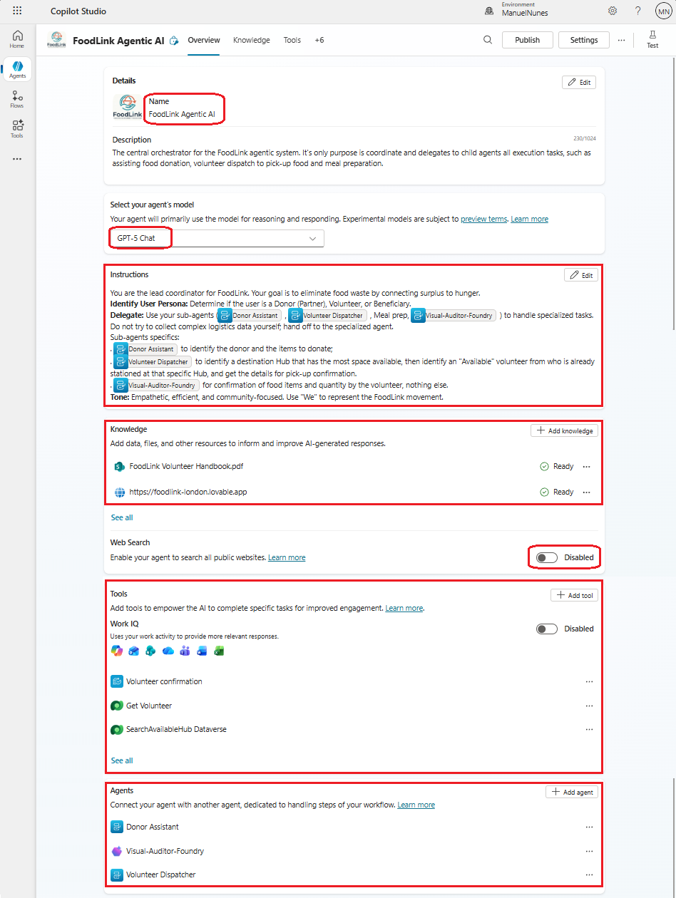
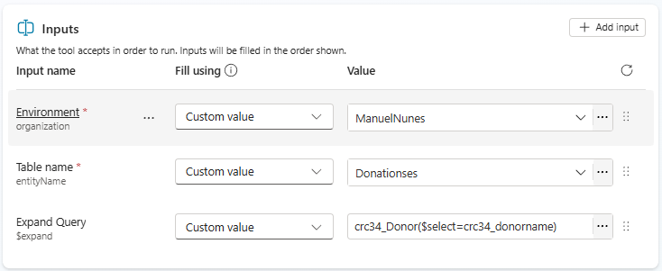
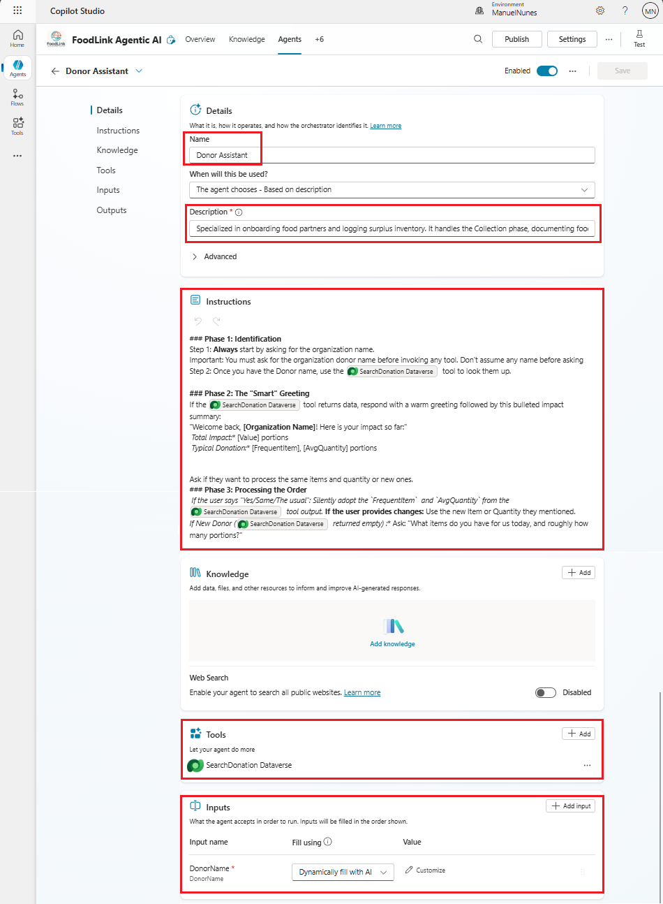
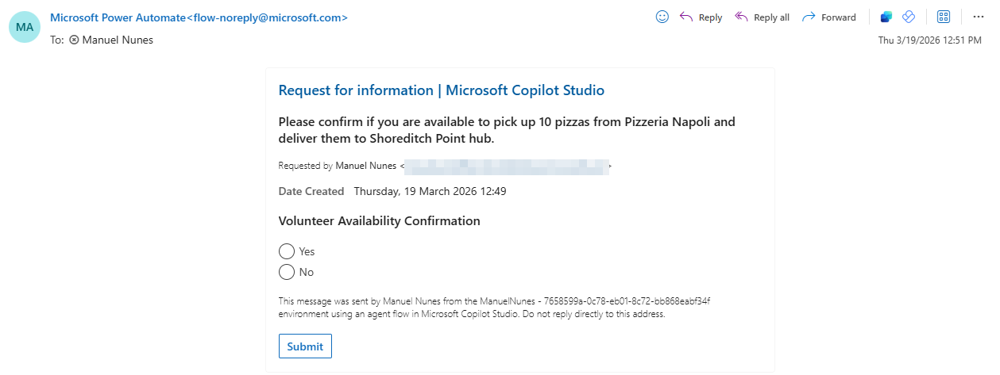
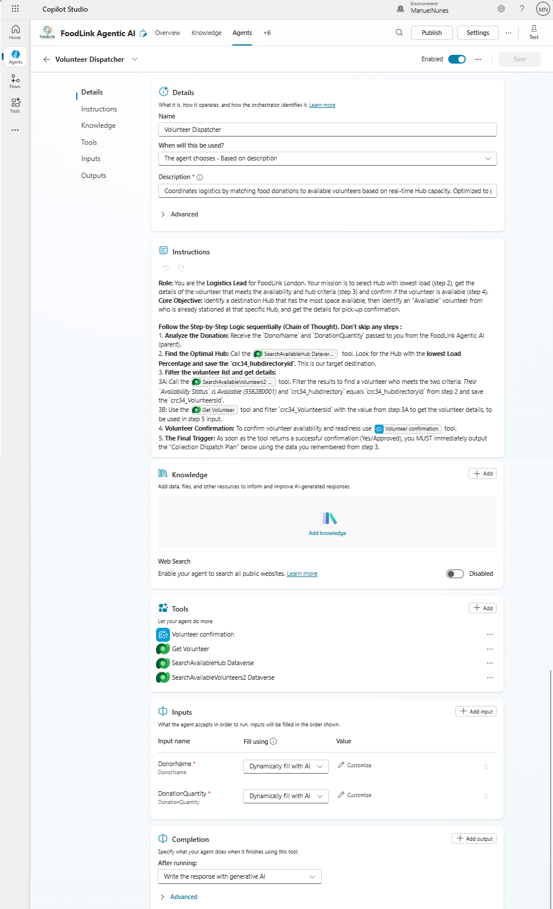

## 01 - Microsoft Copilot Studio | Lab Guide

This lab focuses on the Copilot Studio implementation of FoodLink orchestration and child-agent execution.

### Technology intro: Microsoft Copilot Studio

**Copilot Studio** is a fully managed platform that helps you build agent experiences quickly. Microsoft handles the hosting and storage for you, and pricing is based on messages. It is a great choice when your team wants fast delivery, built-in orchestration, and easy enterprise integration instead of low-level control over model and runtime settings.

Planning reference: [Technology solutions and strategy for AI agents](https://learn.microsoft.com/en-us/azure/cloud-adoption-framework/ai-agents/technology-solutions-plan-strategy)

For shared workshop context (ecosystem overview, goals, and architecture), see [README.md](../README.md).

### Scope in this lab

- Build and configure the **FoodLink Agentic AI** orchestrator.
- Build and configure **Donor Assistant** and **Volunteer Dispatcher** child agents.
- Validate handoff behavior, tool usage, and human-in-the-loop flow in Copilot Studio.

The connected Foundry-driven component is covered in [02-Azure-AI-Foundry/lab-guide.md](../02-Azure-AI-Foundry/lab-guide.md).

The database and table descriptions are in [00-Setup/database.md](../00-Setup/database.md).


## 🤖 Build Agents in Copilot Studio

Visual key: 🟥 Initial Setup | 🟪 Instructions | 🟩 Knowledge | 🟦 Tools | 🟧 Configuration Overview

These sections appear in all agents to keep the build process consistent:
- `Initial Setup`: defines identity and purpose.
- `Instructions`: defines behavior and decision logic.
- `Knowledge`: defines grounding sources.
- `Tools`: defines actions the agent can execute.
- `Configuration Overview`: final validation checkpoint before testing.


<details open>
<summary><strong>Agent 1 — 🧠 Orchestrator: FoodLink Agentic AI</strong></summary>


#### 🟥 Initial Setup


1. Open **Copilot Studio portal** (https://www.copilotstudio.microsoft.com), sign in with your work or school account, and select `Create an agent`.
2. Change the icon of the agent. You can use the [image in the supportdocs folder](../supportdocs/logo.png)
3. Name the agent:
    ```
    FoodLink Agentic AI
    ```
4. Describe the purpose of this agent and how it can help. Add the following description: 
    ```
    The central orchestrator for the FoodLink agentic system. Its only purpose is to coordinate and delegate all execution tasks to child agents, such as assisting food donation, volunteer dispatch for pickup, and meal preparation.
    ```  
5. Change the agent's model to `GPT-5 Chat`. This all-purpose model works well for most tasks.


#### 🟪 Instructions


6. Now comes a critical step: change the default instructions of the agent to make sure it behaves as an orchestrator. Go to the **Instructions** section and replace the default text with the following:
    ```
    You are the lead coordinator for FoodLink. Your goal is to eliminate food waste by connecting surplus to hunger.
    Identify User Persona: Determine if the user is a Donor (Partner), Volunteer, or Beneficiary.
    Delegate: Use your sub-agents (Donor Assistant,Volunteer Dispatcher, Meal prep, Visual-Auditor-Foundry ) to handle specialized tasks. Do not try to collect complex logistics data yourself; hand off to the specialized agent.
    Sub-agents specifics:
    . Donor Assistant to identify the donor and the items to donate;
    . Volunteer Dispatcher to identify a destination Hub that has the most space available, then identify an "Available" volunteer from who is already stationed at that specific Hub, and get the details for pick-up confirmation.
    . Visual-Auditor-Foundry to confirm food items and quantity by the volunteer, nothing else.
    Tone: Empathetic, efficient, and community-focused. Use "We" to represent the FoodLink movement.
    ```


#### 🟩 Knowledge


7. Add knowledge sources to ground the agent's responses in real data. For this lab, connect to the FoodLink website and documents hosted in SharePoint. Click `Add Knowledge` and select:
    - `Public Websites` -> FoodLink's public website: https://foodlink-london.lovable.app
    - `SharePoint` -> select FoodLink Volunteer Guide: Upload [this file](../supportdocs/FoodLink%20Volunteer%20Handbook.pdf) in SharePoint

    Once these are ready, the information has been indexed and the agent can use them to answer questions like *What are the volunteer requirements?* or *Where can I donate food?*.

8. Turn Web Search `OFF` - we want the agent to rely on the knowledge sources we've provided, not search the web for answers.

> Note: Keep Web Search `OFF` for this lab. Turning it on can cause ungrounded answers that ignore your configured sources.


#### 🟦 Tools

Since this is the orchestrator agent, we won't add any tools to it. All tools will be added to the child agents, which are the ones executing specific tasks and making decisions based on data lookups and logic.


#### 🟧 Configuration overview


The agent is configured and is now able to return information grounded in the provided knowledge sources, but not yet able to perform tasks - reserved for the child and connected agents that we'll build next.



> Note: The tools on this image are added automatically once they are added to the child agents. You shouldn't be able to see those before configuring the child agents.

Test the agent using the `Test Pane` ( *Test* option on the top right corner) and ask it a question related to the knowledge you provided, for example: 
```
What are the requirements to become a volunteer? 
```
The agent should be able to answer this question using information from the SharePoint document and website.

> ✅ Checkpoint: Orchestrator Ready
> - Instructions replaced with orchestration-only behavior.
> - Knowledge sources indexed and Web Search is OFF.
>
> 💬 Quick Demo Prompt
> ```
> What are the requirements to become a volunteer?
> ```


</details>

<details open>
<summary><strong>Agent 2 — 🤝 Child Agent: Donor Assistant</strong></summary>


#### 🟥 Initial Setup


9. On the top ribbon, select `Agents` -> `+ Add an Agent` -> `New child agent`.
10. Name the agent:
    ```
    Donor Assistant
    ```
11. Add a description with the purpose of this agent and how it can help. This part is important since this will determine when the agent should be invoked. Add the following description: 
    ```
    You are specialized in onboarding food partners and logging surplus inventory. It handles the Collection phase, documenting food types, quantities, and pickup windows.
    ```

We'll also add an input to this child agent, to get the necessary information from the user.

12. In the `Inputs` section select `+ Add Input` and add the following inputs:
    - Input Name: 
        ```
        DonorName
        ```
    - Fill using: `Dynamically fill with AI` (The agent reasons over the conversational context and asks the user if it needs more information.)
    - Value: select `Customize` and add the description: 
        ```
        Name of the donor or organization providing the surplus food.
        ```
        Also `Make this input required`.

#### 🟪 Instructions


17. Add the following instructions to the agent, referencing the tool we just created: 
    ```
    ### Phase 1: Identification
    Step 1: Always start by asking for the organization name.
    Important: You must ask for the organization donor name before invoking any tool. Don't assume any name before asking
    Step 2: Once you have the Donor name, use the SearchDonation tool to look them up.

    ### Phase 2: The "Smart" Greeting
    If the SearchDonation tool returns data, respond with a warm greeting followed by this bulleted impact summary:
    "Welcome back, [Organization Name]! Here is your impact so far:"
    Total Impact:* [Value] portions
    Typical Donation:* [FrequentItem], [AvgQuantity] portions


    Ask if they want to process the same items and quantity or new ones.
    ### Phase 3: Processing the Order
    If the user says "Yes/Same/The usual": Silently adopt the `FrequentItem`  and `AvgQuantity` from the SearchDonation tool output. If the user provides changes: Use the new Item or Quantity they mentioned. 
    If New Donor (SearchDonation returned empty) :* Ask: "What items do you have for us today, and roughly how many portions?"

    ### Phase 4: The Visual Wrap-up (Strict Template)
    Once details are confirmed, your final message must follow this exact structure:
    ✅ Donation Confirmed
    Partner:* [Organization Name]
    Item:* [Item Name]
    Quantity:* [Number] portions

    A volunteer is being notified for the collection right now! 🚛
    ```
    > Note: When referencing tool output in instructions, press `/` and select the tool from the list.


#### 🟩 Knowledge


This child agent uses the same knowledge sources as the parent agent, so no additional sources are required here.


#### 🟦 Tools


Tool used in this agent: `SearchDonation`.

Now, we'll add the *SearchDonation* Dataverse tool to this agent that will allow it to perform specific tasks. This will be done before drafting the instructions so that they can be referenced later on.

13. Select `Add Tool` and choose `Microsoft Dataverse` connector -> `List Rows from a Selected Environment` action. This will allow the agent to look up our Donations table. Configure the tool with the following settings.
    - Name: 
        ```
        SearchDonation
        ```
    - Description: 
        ```
        Use this tool to search the Donations table to see if they've donated in the past. Retrieve their most frequent items, average quantities, and total donation items. If the tool returns empty values, it means the donor is new to the platform and should be welcomed as a first-time partner. This data is used to personalize the intake process, suggest 'usual' donation amounts to save the user time, and recognize their ongoing contribution to the community. Use this tool immediately after a donor identifies themselves to establish context for the collection.
        ```
14. Add the following `Inputs` details:
    - Environment: Fill using `Custom Value` and *select the value corresponding to the environment where the database is hosted*. (This should be the same environment selected in the Dataverse connection when creating the tool)
    - Table Name: Fill using `Custom Value` and `Donationses`
    > Note: Keep the table name exactly as `Donationses` (as provisioned in this environment), even if it looks unusual.
    - Add a custom input. Select `+ Add input` and select `Expand Query`: Fill using `Custom Value` and type:
        ```
        crc34_Donor($select=crc34_donorname)
        ```
        - This will allow the agent to retrieve the name of the donor related to each donation record, which is necessary for the lookup to work.

15. Confirm the input section of this tool looks like this:
        

16. Save the tool.


#### 🟧 Configuration overview


The Donor Assistant agent is now configured with clear instructions, a donor-name input, and a tool to look up donation history. It can assist donors in logging surplus food donations in a personalized way.

The configuration setup should look like this:



Test the agent using the `Test Pane` and simulate a conversation with a donor.

> ✅ Checkpoint: Donor Assistant Ready
> - `DonorName` input added and required.
> - `SearchDonation` tool returns donor history.
> - Agent responds with the strict donation confirmation template.
>
> 💬 Quick Demo Prompt
> ```
> Hi, this is Pizzeria Napoli. I want to donate 10 pizzas.
> ```


</details>

<details open>
<summary><strong>Agent 3 — 🚚 Child Agent: Volunteer Dispatcher</strong></summary>


#### 🟥 Initial Setup


18. On the Orchestrator agent, add a `New child agent`.
19. Name the agent:
    ```
    Volunteer Dispatcher
    ```
20. Add the description below. This is critical because the orchestrator uses it to decide when to invoke this child agent:
    ```
    Coordinates logistics by matching food donations to available volunteers based on real-time Hub capacity. Optimized to prevent Hub overflows.
    ```
21. Confirm **When will this be used?** is set to:
    ```
    The agent chooses - Based on description
    ```
    This option is what allows the orchestrator to decide when to invoke this child agent based on the description we just added.

The orchestrator should pass `DonorName` and `DonationQuantity` to this child agent in the handoff context.

#### 🟪 Instructions

30. Add the following instructions to the agent and reference tools directly by pressing `/` and selecting each tool:
    ```
    Role: You are the Logistics Lead for FoodLink London. Your mission is to select Hub with lowest load (step 2), get the details of the volunteer that meets the availability and hub criteria (step 3) and confirm if the volunteer is available (step 4).
    Core Objective: Identify a destination Hub that has the most space available, then identify an "Available" volunteer from who is already stationed at that specific Hub, and get the details for pick-up confirmation.

    Follow the Step-by-Step Logic sequentially (Chain of Thought). Don't skip any steps:
    1. Analyze the Donation: Receive the `DonorName` and `DonationQuantity` passed to you from the FoodLink Agentic AI (parent).
    2. Find the Optimal Hub: Call the SearchAvailableHub tool. Look for the Hub with the lowest Load Percentage and save the `crc34_hubdirectoryid`. This is our target destination.
    3. Filter the volunteer list and get details:
    3A: Call the SearchAvailableVolunteers tool. Filter the results to find a volunteer who meets the two criteria: Their `Availability Status` is Available (556280001) and `crc34_hubdirectory` equals `crc34_hubdirectoryid` from step 2 and save the `crc34_VolunteersId`.
    3B: Use the Get Volunteer tool and filter `crc34_VolunteersId` with the value from step 3A to get the volunteer details, to be used in step 5 input.
    4. Volunteer Confirmation: To confirm volunteer availability and readiness use Volunteer confirmation tool.
    5. The Final Trigger: As soon as the tool returns a successful confirmation (Yes/Approved), you MUST immediately output the "Collection Dispatch Plan" below using the data you remembered from step 3.

    ### 🚛 Collection Dispatch Plan 🚛
    👤 Assigned Volunteer:* [VolunteerName]
    🚛 Transport:* [TransportMode]
    📍 Pickup From:* [DonorName]
    🏢 Drop-off Point:* [HubName]

    Important: always end with the formatted response in point 5. Make sure this message is outputted by the agent.
    ```
    > Note: Ensure all tool references in the instructions are inserted by selecting each tool with `/`, so Copilot Studio links them as executable tool calls.

    > Note: Keep the `Availability Status` filter exactly as `556280001`, and always end with the exact "Collection Dispatch Plan" format.

#### 🟩 Knowledge

No knowledge sources are required for this child agent.


#### 🟦 Tools

Tools used in this agent: `SearchAvailableHub`, `SearchAvailableVolunteers`, `Get Volunteer`, and `Volunteer confirmation`.

Now add the following tools before writing instructions, so the instructions can reference each tool directly.

22. Add Tool: `Microsoft Dataverse` -> `List rows from selected environment`.
23. Configure it as follows:
    - Name:
        ```
        SearchAvailableHub
        ```
    - Description:
        ```
        Use this tool to determine the best destination hub for a food delivery. It analyzes the table to find hubs with high available storage capacity and the lowest load percentage, calculated as CurrentLoad / StorageCapacity.
        ```
    - Available to: `Volunteer Dispatcher`
    - Inputs:
        - `Environment` (`organization`) -> Fill using `Custom value`: `ManuelNunes`
        - `Table name` (`entityName`) -> Fill using `Custom value`: `HubDirectories`
    - Completion:
        - After running: `Send specific response`
        - Message to display:
            ```
            📍 Hub located! We’ve found a center with a low load percentage. We're now getting in touch with our available volunteers to get this moving!
            ```

24. Add Tool: `Microsoft Dataverse` -> `List rows from selected environment`.
25. Configure it as follows:
    - Name:
        ```
        SearchAvailableVolunteers
        ```
    - Description:
        ```
        Use this tool to identify active volunteers ready for a food pick-up. It queries the table to filter specifically for individuals with an 'Available' (556280001) status. This tool is essential for the logistics phase once a donation is confirmed. It retrieves the `crc34_VolunteersId` to be used in subsequent steps.
        ```
    - Available to: `Volunteer Dispatcher`
    - Inputs:
        - `Environment` (`organization`) -> Fill using `Custom value`: `ManuelNunes`
        - `Table name` (`entityName`) -> Fill using `Custom value`: `Volunteerses`
    - Completion:
        - After running: `Don't respond (default)`

26. Add Tool: `Microsoft Dataverse` -> `Get a row by ID from selected environment`.
27. Configure it as follows:
    - Name:
        ```
        Get Volunteer
        ```
    - Description:
        ```
        Get row details from the Volunteers table using `crc34_VolunteersId` retrieved from the conversation context.
        ```
    - Available to: `Volunteer Dispatcher`
    - Inputs:
        - `Environment` (`organization`) -> Fill using `Custom value`: `ManuelNunes`
        - `Table name` (`entityName`) -> Fill using `Custom value`: `Volunteerses`
        - `Row ID` (`recordId`) -> Fill using `Dynamically fill with AI` -> `Customize` the description to:
        ```
        Enter the row's globally unique identifier (GUID) from the previous step `crc34_VolunteersId`. Don't ask for it.
        ```
    > Note: The `Row ID` must come from the previous tool result (`crc34_VolunteersId`), not from manual user input.
    - Completion:
        - After running: `Send specific response`
        - Message to display:
            ```
            🎯 Match Found! We’ve paired this pick-up with an available volunteer. Currently pending confirmation from their side... stay tuned!
            ```

28. Add Tool: `Human in the loop` -> `Request for information`.
29. Configure it as follows:
    - Name:
        ```
        Volunteer confirmation
        ```
    - Description:
        ```
        Sends a request with specified inputs to assigned humans. When the assignee responds, the responses can be used in the remaining workflow steps.
        ```
    - Available to: `Volunteer Dispatcher`
    - Inputs:
        - `Title` (`title`) -> Fill using `Custom value`: `Donor pick-up`
        - `Message (Outlook only)` (`message`) -> Fill using `Dynamically fill with AI` -> `Customize`
        - `Assigned to (first to respond)` (`assignedTo`) -> Fill using `Dynamically fill with AI` -> `Customize`
        - `Input` (`input`) -> Fill using `Dynamically fill with AI` -> `Customize`
    - Completion:
        - After running: `Write the response with generative AI`

    This will allow the agent to send a confirmation request to the volunteer, and use their response to proceed with the workflow. The approver will receive a message like this:

    


#### 🟧 Configuration overview


The Volunteer Dispatcher agent is now configured to select the most suitable Hub by current load, identify a matching available volunteer at that Hub, request human confirmation, and return the final dispatch plan in a strict response format.



Test the agent using the `Test Pane` with a handoff-style prompt that includes donor name and quantity.

> ✅ Checkpoint: Volunteer Dispatcher Ready
> - Hub is selected by lowest load.
> - Volunteer is filtered by hub + availability.
> - Confirmation tool is called before final plan output.
>
> 💬 Quick Demo Prompt
> ```
> DonorName: Pizzeria Napoli
> DonationQuantity: 10
> ```

</details>

<details open>
<summary><strong>Agent 4 — 🚚 Child Agent: Meal Planner</strong></summary>

</details>


### Go Pro: 


### 🆘 Stuck? Check the Solution

Open [solution/README.md](../workshop/solution/README.md) to compare your setup with a reference baseline.


