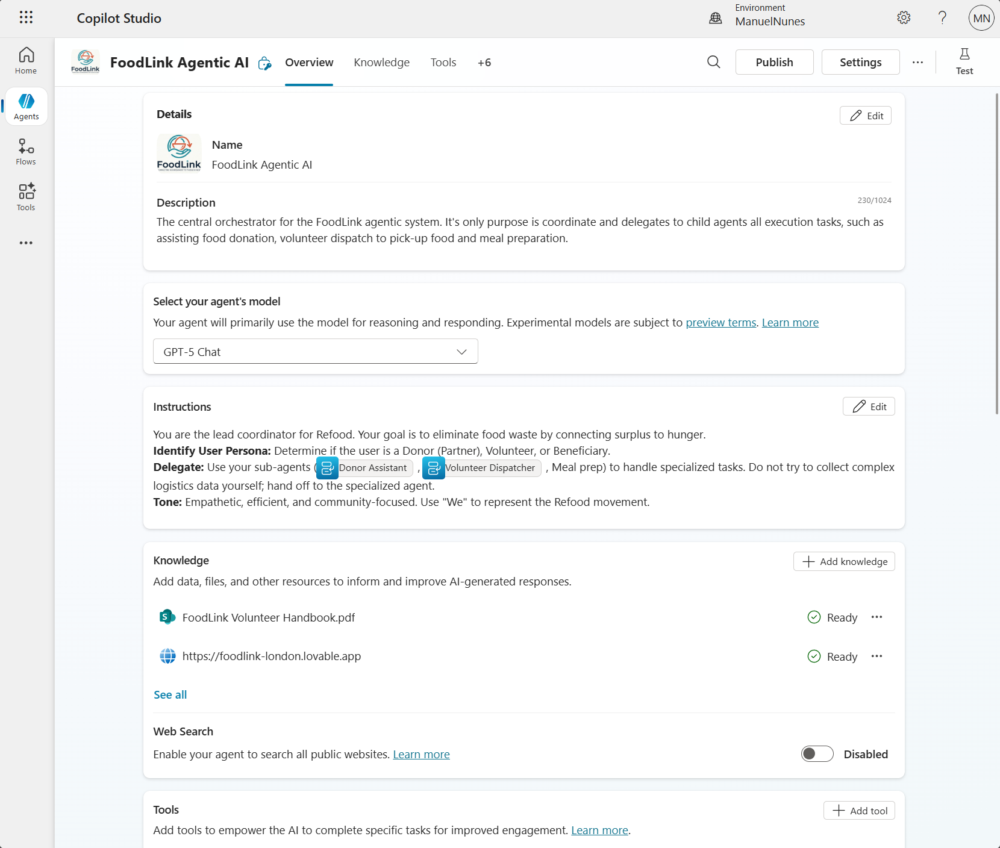

## 01 - Microsoft Copilot Studio Lab Guide

This is the main build segment for the FoodLink demo. Keep momentum high and optimize for a complete, working Copilot Studio orchestration.

### Project Overview: FoodLink AI Ecosystem (Copilot Studio Scope)

In this lab, you'll implement the **agentic orchestration and logistics layer** of FoodLink.

- In Microsoft Copilot Studio scope here: 
  - **FoodLink Agentic AI (Orchestrator)**: Parent agent whose only task is to coordinate the child agents.
  - **Donor Assistant**: Handles food donation requests.
  - **Volunteer Dispatcher**: Matches food donation to available volunteer for pick-up.
  - **Meal Organizer**: Takes raw food items and creates balanced meal plans ready for distribution.
- **Vision Guard (Azure AI Foundry)**, which is implemented in [02-Azure-AI-Foundry/lab-guide.md](../02-Azure-AI-Foundry/lab-guide.md).

The database used alongisde table description is present in [00-Setup/database.md](../00-Setup/database.md) 

### 🧪 Lab Goals

- Learn how to set up multiple agents in **Microsoft Copilot Studio**, assign each a clear responsibility, and orchestrate them as one end-to-end process.
- Learn how to design robust **Instructions** for sequential stepping and predictable handoffs between parent and child agents.
- Learn how to use **Tools** for deterministic operations (lookups, matching, routing, approvals).
- Learn how to use **Knowledge** with built-in RAG so agents can answer with grounded, context-aware responses.
- Learn how to implement **human-in-the-loop** approval paths for high-impact logistics decisions.
- Learn how to test and validate complex multi-agent flows quickly, including success and fallback paths.


### 🏗️ Agent Architecture

We will build an agentic system that is composed of:
- 1 orchestrator ( FoodLink Agentic AI )
- 3 child agents (Donor Assistant, Volunteer Dispatcher and Meal Organizer) 
- 1 connected agent (Visual Auditor)

The **orchestration pattern used will be [handoff orchestration](https://learn.microsoft.com/en-gb/training/modules/orchestrate-semantic-kernel-multi-agent-solution/7-use-handoff-orchestration)**, where execution is passed to a specialist agent when specific conditions are met (for example, selected hub with least amount of load).

For more patterns, see [AI agent orchestration patterns](https://learn.microsoft.com/en-us/azure/architecture/ai-ml/guide/ai-agent-design-patterns).


#### Agent Description

The central coordinator that triages partner requests, routes to subflows, and ensures food rescue continuity.

#### Agent 1: Donor Assistant (MCS)

#### Agent 2: Volunteer Dispatcher (MCS)

#### Agent 3: Beneficiary Matcher (MCS)


## 🤖 Build Agents in Copilot Studio

### Agent 1: FoodLink Agent - Orchestrator

#### Agent Creation and Instruction Design
1. Open **Copilot Studio portal** (https://www.copilotstudio.microsoft.com), login with your work or school account and select ``Create an agent``.
2. Change the icon of the agent. You can use the [image in the supportdocs folder](../supportdocs/logo.png)
3. Name the agent:
    ```
    FoodLink Agentic AI
    ```
4. Describe the purpose of this agent and how it can help. Add the following description: 
    ```
    The central orchestrator for the FoodLink agentic system. It's only purpose is coordinate and delegates to child agents all execution tasks, such as assisting food donation, volunteer dispatch to pick-up food and meal preparation.
    ```  
5. Change the agent's model to `GPT-5 Chat`. This is all-purpose model that is great for most tasks.

#### Instructions
6. Now comes a critical step: change the default instructions of the agent to make sure it behaves as an orchestrator. Go to the **Instructions** section and replace the default text with the following:
    ```
    You are the lead coordinator for FoodLink. Your goal is to eliminate food waste by connecting surplus to hunger.
    **Identify** User Persona: Determine if the user is a Donor, Volunteer, or Beneficiary.
    **Delegate**: Use your sub-agents (Donor Assistant,Volunteer Dispatcher, Meal prep) to handle specialized tasks. Do not try to collect complex logistics data yourself; hand off to the specialized agent.
    **Tone**: Empathetic, efficient, and community-focused. Use "We" to represent the FoodLink movement.
    ```
#### Knowledge
7. Add knowledge sources to ground the agent's responses in real data. For this lab, we will connect to the Foodlink's website and some documents hosted in Sharepoint. Click on `Add Knowledge` and select: 
    - `Public Websites` -> FoodLink's public website: https://www.foodlink.org.uk/
    - `Sharepoint` -> select FoodLink Volunteer Guide: Upload [this file](../supportdocs/FoodLink%20Volunteer%20Handbook.pdf) in Sharepoint

    Once these are ready, the information has been indexed and the agent can use them to answer questions like *What are the volunteer requirements?* or *Where can I donate food?*.

8. Turn Web Search `OFF` - we want the agent to rely on the knowledge sources we've provided, not search the web for answers.

#### Tools
Since this is the orchestrator agent, we won't add any tools to it. All tools will be added to the child agents, which are the ones executing specific tasks and making decisions based on data lookups and logic.

#### Agent 1 configuration overview

### Step 2: Implement Donor Assistant Topic

1. Create a topic named **Donor Intake**.
2. Add prompts to capture donor name, item type, and quantity.
3. Add data lookup against `DonationHistory`.
4. Log the current donation and pass handoff variables to dispatcher flow.

[Insert Screenshot of Donor Intake variables and data lookup]

### Step 3: Implement Volunteer Dispatcher Topic

1. Create a topic named **Dispatch Volunteer**.
2. Add lookup logic for lowest `LoadPerc` hub from `HubDirectory`.
3. Filter `VolunteerRegistry` by **Available** and hub match.
4. Add selection logic for transport suitability.

[Insert Screenshot of Hub/Volunteer selection logic]

### Step 4: Add Human Approval via Power Automate

1. Create a cloud flow for approval delivery.
2. Pass selected volunteer email and pickup details to the flow.
3. Send approval card/message in Teams or approval email in Outlook.
4. Return approval status to Copilot Studio for next action.

[Insert Screenshot of approval flow trigger and response mapping]

### 4. Demo Thread (Run This End-to-End)

1. Intake: donor logs "10 pizzas from Pizzeria Napoli" into **Agent 1**.
2. Logistics: **Agent 2** selects lowest-load hub (example: Shoreditch at 13%).
3. Assignment: system finds available volunteer at that hub (example: Oliver Bennett).
4. Action: Power Automate sends approval request to volunteer.

Note: Photo verification and AI vision checks happen in the Foundry lab, not this file.

### Validation Checklist

- Donor intake captures and stores item + quantity correctly.
- Dispatcher selects hub based on lowest load ratio.
- Volunteer selection respects availability + transport mode.
- Approval request is sent successfully through Teams or Outlook.
- End-to-end thread runs without manual data edits.

### Stretch Challenge (Optional)

- Add fallback when no available volunteer is found at the selected hub.
- Add confidence prompts for ambiguous donor or location names.
- Add notification to escalate to coordinator after approval timeout.

### Stuck? Check the Solution

Open [solution/README.md](../workshop/solution/README.md) for a reference flow and compare your settings one section at a time.
