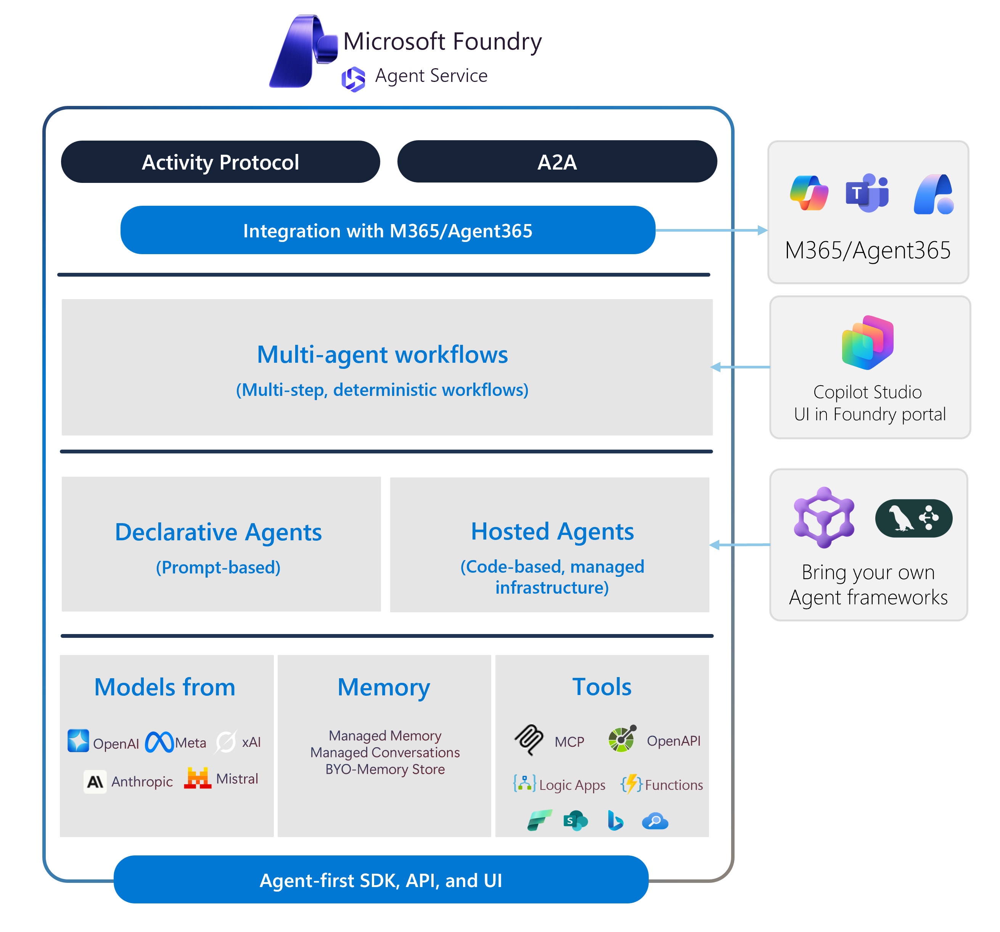
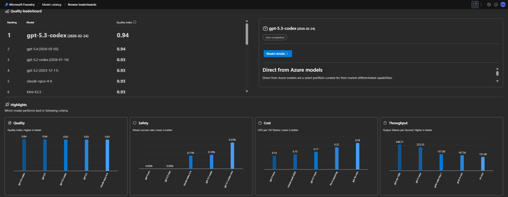
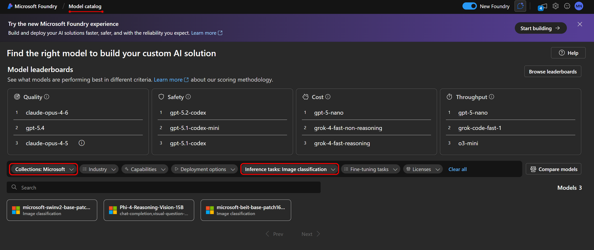
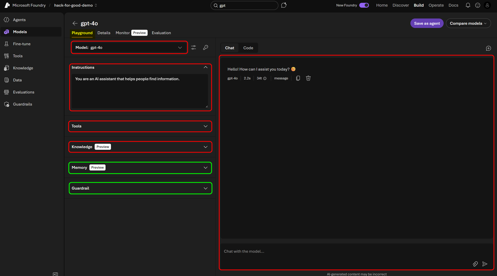
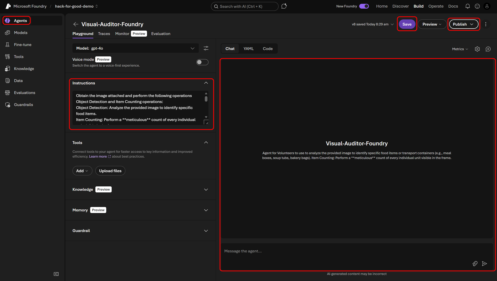
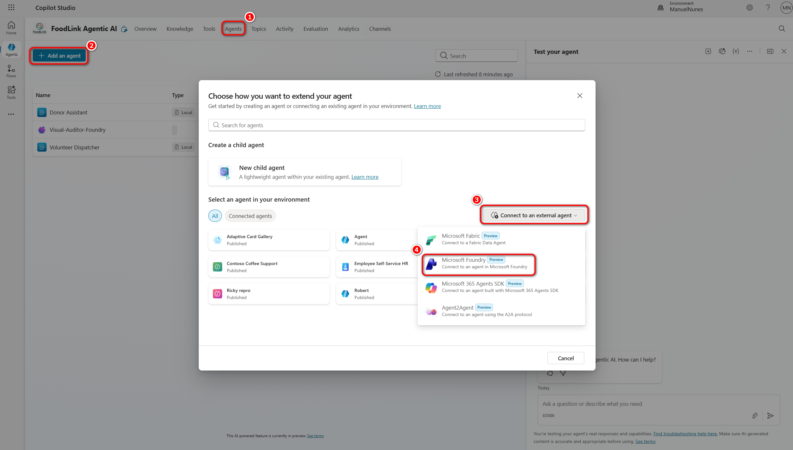
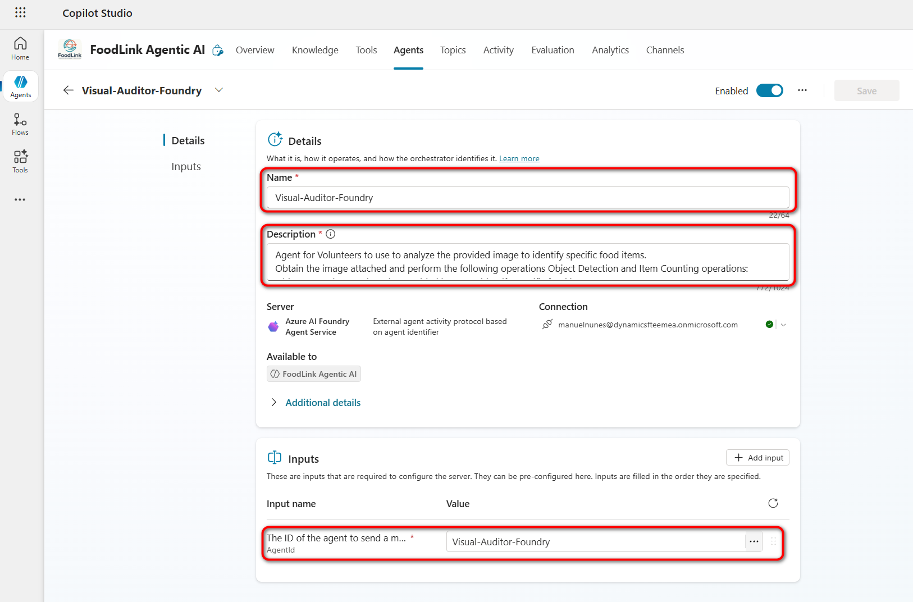

## 02 - Azure AI Foundry | Lab Guide

This lab moves from low-code setup into model and prompt engineering decisions that improve output quality.

### Technology intro: Microsoft Foundry

**Microsoft Foundry** is a middle option between quick, fully managed Copilot experiences and fully custom infrastructure. It gives your team more control over orchestration, model choice, prompt testing, and development workflow (VS Code + GitHub + Foundry portal), while still providing a managed platform experience.



Planning reference: [Technology solutions and strategy for AI agents](https://learn.microsoft.com/en-us/azure/cloud-adoption-framework/ai-agents/technology-solutions-plan-strategy)


### Scope in this lab

- Evaluate and compare model behavior in Azure AI Foundry.
- Iterate on system prompts for safer and more actionable responses.
- Define how Foundry outcomes connect back into the Copilot Studio experience.

For shared workshop context (ecosystem overview, global goals, and architecture), see [README.md](../README.md).

## 🔬 Build in Azure AI Foundry

Follow this sequence to select a model, configure a Foundry agent, connect it to Copilot Studio, and validate the end-to-end flow.

### What you will complete

- Select and test a model in Foundry.
- Configure a Visual Auditor agent with structured output.
- Connect the published Foundry agent to Copilot Studio.
- Validate the full Copilot Studio + Foundry flow.

### 🔎 Model Catalog Exploration

Before you begin this phase, complete **Step-by-Step: Azure $200 Free Account (30 Days) ☁️** in the [Setup Guide](../00-Setup/setup-guide.md).

1. Open **Azure AI Foundry** (https://ai.azure.com/) and sign in with your assigned sandbox **work or school account**.

2. Go to the **Model Catalog** and review available models.
    Use the **Model Leaderboard** to compare capabilities and benchmark performance (Quality, Safety, Cost, Throughput).

    

3. Filter the catalog by:
    - **inference task**: Image Classification
    - **Collections**: Microsoft


    

    > Note: These filters help you find vision models for the connected agent (Vision Guard). You can explore other filters based on your use case.

4. Select the *Phi-4-reasoning-vision-15b* model and review the details about its capabilities, benchmarks, and pricing.


    > Note: Phi-4 models are not available in the free tier. For this lab, you can review Phi-4 details, then continue with another all-purpose model such as gpt-4o or Llama-3.

5. Select "Use this model" to deploy it and make it available for testing. Follow the steps until completion.

6. Once the model is deployed, open the **Playground** and select the deployed model.

    

    > Note: For learning purposes and accessibility, we use gpt-4o in this lab because it is available in the free tier.

   Like Microsoft Copilot Studio, Microsoft Foundry includes options to add tools and knowledge bases for RAG scenarios. It also includes **Persistent Memory**, which allows the model to remember information across interactions, and **Guardrails**, which apply safety constraints to model behavior.

7. Test the model with a sample prompt and review the output. Upload a sample photo to verify object detection.

8. Click **Save as an agent** to create an agent that is ready to plug into Copilot Studio.

### 🔧 Foundry Agent Configuration

9. Update the agent instructions to fit the use case of the **Visual Auditor** connected agent in our architecture. Include:

    ```
    Obtain the image attached and perform the following operations Object Detection and Item Counting operations:
    Object Detection: Analyze the provided image to identify specific food items. 
    Item Counting: Perform a **meticulous** count of every individual unit visible in the frame.
    Verification: Confirm if the visible contents align with the expected food category.
    Strict Output: You must provide your findings in a structured format for the Orchestrator to parse. Do not include conversational filler.
    Output Format:
    Food Items: [List detected items]
    Quantity: [Total count as a number]
    "Do you confirm this is the pick-up?"

    Important: Only display the information below and ask for the user for confirmation. Don't ask for anything else apart from user confirmation.
    ```

10. For this workshop, leave **Tools**, **Knowledge**, and **Memory** empty, and keep **Guardrails** at default settings.

11. Use the **Chat Mode** to test the agent.

12. Select **Save** and **Publish** to make the agent available for integration in Copilot Studio.

    

### 🔗 Integration into Copilot Studio

13. Open your Copilot Studio agent notes from [Lab 01](../01-Copilot-Studio/lab-guide.md), select the **Agents** tab and **+ Add an agent**.

14. Then, select **Connect to an external Agent** and select **Microsoft Foundry**.


    


15. Add the following details:
    - Name: 
        ```
        Visual-Auditor-Foundry
        ```
    - Description: 
        ```
        Agent for Volunteers to use to analyze the provided image to identify specific food items.
        Obtain the image attached and perform the following operations Object Detection and Item Counting operations:
        Object Detection: Analyze the provided image to identify specific food items. 
        Item Counting: Perform a **meticulous** count of every individual unit visible in the frame.
        Strict Output: You must provide your findings in a structured format for the Orchestrator to parse. Do not include conversational filler.
        Output Format:
        Food Items: [Detected Items]
        Quantity: [Total count as a number]
        "Do you confirm this is the pick-up?"

        Important: Only display the information below and ask for the user for confirmation. Don't ask for anything else apart from user confirmation.
        ```
    - The ID of the agent to send a message to: 
        ```
        Visual-Auditor-Foundry
        ```

        Note: The agent ID is the same as the name by default, but you can find it in the URL when you open the agent in Foundry.

16. Select **Save**.

17. Your connected agent should be configured and ready to use in your Copilot Studio experience.

    

### 🧪 Test the end-to-end flow

Now test the full flow with the connected agent.
Go to the Test section in [Lab 01](../01-Copilot-Studio/lab-guide.md) and validate how Copilot Studio and Foundry work together in the orchestration.

### ✅ Validation Checklist

- One candidate model was selected with a short rationale.
- Agent instructions were updated with structured output and confirmation-only behavior.
- Foundry agent was published and connected to Copilot Studio.
- End-to-end flow was tested from Copilot Studio using the connected Foundry agent.

### 🆘 Stuck? Check the Solution

Open [solution/README.md](../workshop/solution/README.md) to compare your model selection and prompt structure with a sample baseline.
