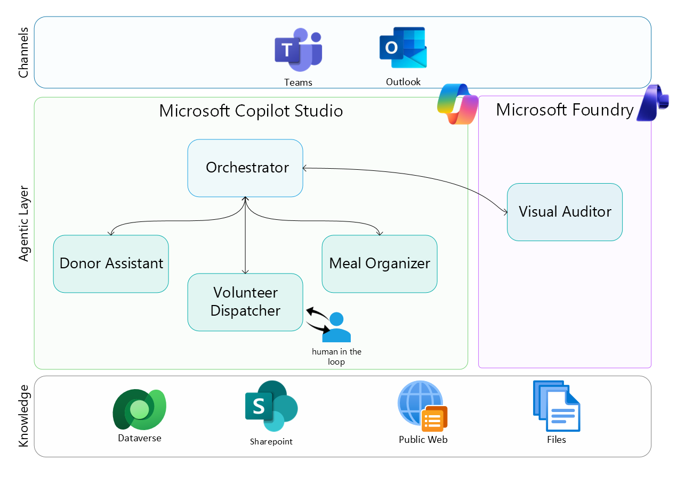

# AI for Good Hackathon: Building AI Agents for Social Impact

This repo is a guided workshop for building an AI-for-Good scenario with AI Agents taking the example of [**FoodLink**](https://foodlink-london.lovable.app/), an organization where donors, volunteers, and coordinators collaborate through agentic workflows.

You will implement:
- Low-code agent orchestration in Copilot Studio.
- Model and prompt experimentation in Microsoft Foundry.
- A path toward pro-code multi-agent patterns.

 

## 🧩 Use Case: FoodLink

[**FoodLink**](https://foodlink-london.lovable.app/) is a (fictitious although illustrative) social impact organization where donors (restaurants, grocery stores, farms) provide surplus food to beneficiaries (shelters, food banks), who then prepare meals for distribution.

Our goal is to **use AI Agents to optimize the coordination between donors, volunteers, and beneficiaries**, reducing food waste and increasing efficiency in meal preparation.

<ins>Don't know what is an AI Agent?</ins> Check out the section below on [Resources](#useful-resources) to get up to speed.

## 🏗️ Architecture

The architecture in this workshop includes five agents (listed below), each with its own tasks and instructions, operating in an **Supervisor + human-in-the-loop orchestration** pattern where execution passes to specialist agents when conditions are met.

- 1 orchestrator: **FoodLink Agentic AI**.
- 3 child agents: **Donor Assistant**, **Volunteer Dispatcher**, **Meal Organizer**.
- 1 connected Microsoft Foundry agent: **Visual Audit**.

Reference: [AI agent orchestration patterns](https://learn.microsoft.com/en-us/azure/architecture/ai-ml/guide/ai-agent-design-patterns)

## 🧭 Learning Path

Recommended order:

1. [00-Setup](00-Setup/setup-guide.md): Pre-requisites to access Microsoft Copilot Studio and Foundry.
   - [Database Schema](00-Setup/database.md): Dataverse tables and ER diagram used by the agents.
2. [01-Copilot-Studio](01-Copilot-Studio/lab-guide.md): Building Agents with Copilot Studio.
3. [02-Azure-AI-Foundry](02-Azure-AI-Foundry/lab-guide.md): Extending with Microsoft Foundry for specialized capabilities.
4. [03-Production-Readiness](03-Production-Readiness/lab-guide.md): Taking your agents to production with security, testing, monitoring, and governance.

## ✅ Workshop Outcomes

By the end of the workshop, each team knows how to:
- Understand the core components of an AI agent architecture and the tools to build it.
- Build a functioning Copilot Studio orchestrator with child and connected agent handoffs.
- Test a model and prompt strategy in Microsoft Foundry.
- Develop a practical path for multi-agent implementation.

## 🆘 Feeling Stuck?
- Check the [presentation](supportdocs/AI%20for%20Good%20-%20hackathon%20.pdf) with supporting guidance.
- Download the agent solution (coming soon) with the samples used for this workshop.

## 🔗 Useful Resources

### Microsoft Copilot Studio

- Copilot Studio portal: https://copilotstudio.microsoft.com/
- Copilot Studio documentation: https://learn.microsoft.com/en-us/microsoft-copilot-studio/
- Copilot Studio learning path: https://learn.microsoft.com/training/paths/work-power-virtual-agents/

### Microsoft Foundry

- Microsoft Foundry portal: https://ai.azure.com/
- Azure AI Foundry documentation: https://learn.microsoft.com/azure/ai-foundry/
- Microsoft Foundry Agent Service Starter Kit: https://github.com/NicoGrassetto/Foundry-Agent-Service-Starter-Kit

### 🚀 Going Pro
- Copilot Studio Empowered by Azure: https://github.com/Azure/Copilot-Studio-and-Azure
- Cloud Adoption Framework for AI agents: https://learn.microsoft.com/azure/cloud-adoption-framework/ai-agents/
- Multi-Agent Custom Automation Engine Solution Accelerator: https://github.com/microsoft/Multi-Agent-Custom-Automation-Engine-Solution-Accelerator
- AI agent design patterns: https://learn.microsoft.com/azure/architecture/ai-ml/guide/ai-agent-design-patterns

## 📌 Project Metadata

- [CODE_OF_CONDUCT.md](CODE_OF_CONDUCT.md)
- [SECURITY.md](SECURITY.md)
- [SUPPORT.md](SUPPORT.md)
- [LICENSE](LICENSE)
